# ✈️ DBSCAN & Clustering Project – Airline Passenger Segmentation

## 📌 Project Overview

This project focuses on applying multiple **Unsupervised Machine Learning Clustering Algorithms** on airline passenger traffic data to identify hidden airline patterns and operational similarities.

### Algorithms Used

- K-Means Clustering
- Agglomerative Hierarchical Clustering
- DBSCAN Clustering

The project also includes:

- Exploratory Data Analysis (EDA)
- Sweetviz Automated EDA Report
- Outlier Detection
- Cluster Visualization
- Silhouette Score Evaluation
- Model Saving using Pickle

---

# 📂 Dataset

The dataset contains airline operational statistics such as:

- Operating Airline
- GEO Region
- Passenger Count
- Flights Held
- Boarding Area
- Terminal
- Year
- Month

---

# 🛠️ Technologies Used

- Python
- Pandas
- NumPy
- Matplotlib
- Scikit-Learn
- Sweetviz
- SQLAlchemy
- Pickle

---

# 📊 Exploratory Data Analysis (EDA)

## 1️⃣ Airline Flights vs Passenger Analysis

This scatter plot visualizes airline operational scale.

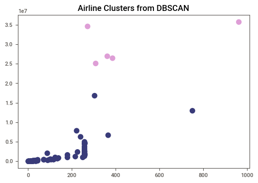

### 🔍 Insights

- United Airlines had the highest passenger traffic.
- Most airlines are concentrated in the lower-left region.
- Two strong outliers were identified:
  - United Airlines
  - United Airlines – Pre 07/01/2013
- Outliers were removed before clustering because clustering algorithms are distance-sensitive.

---

# 📈 Sweetviz Automated EDA

## 2️⃣ Operating Airline Analysis

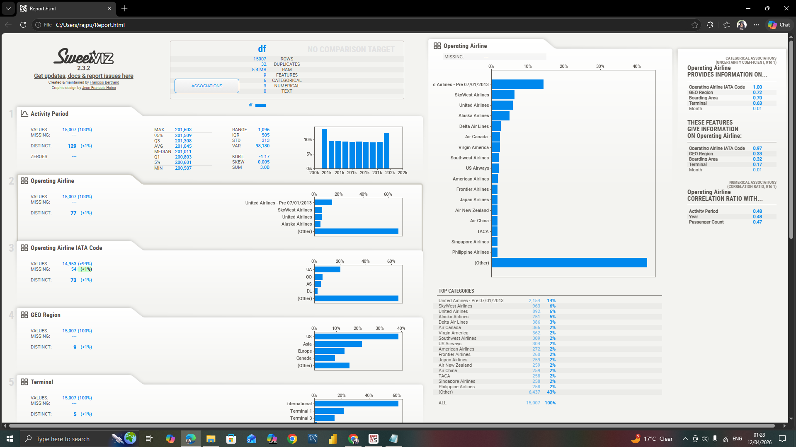

### 🔍 Insights

- United Airlines dominates operational traffic.
- SkyWest Airlines and Alaska Airlines also show strong activity.
- Passenger count is positively correlated with operating airline frequency.

---

## 3️⃣ GEO Region Analysis

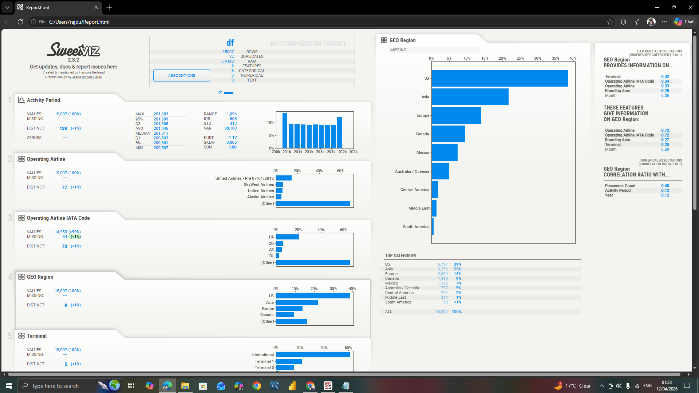

### 🔍 Insights

- US region contributes the highest airline traffic.
- Asia and Europe are secondary major traffic regions.
- South America and Middle East show lower operational traffic.

---

## 4️⃣ Boarding Area Analysis

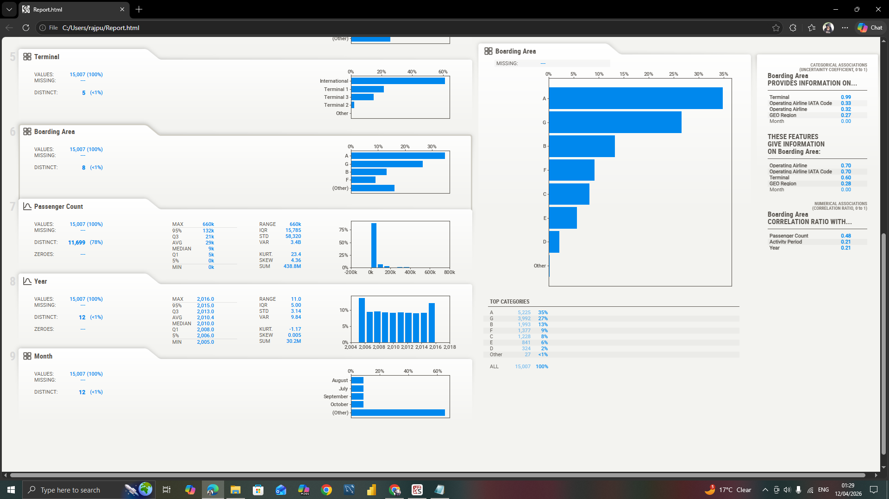

### 🔍 Insights

- Boarding Area A handles the largest passenger movement.
- Boarding Areas G and B also contribute significantly.
- Boarding area strongly correlates with airline operations.

---

## 5️⃣ IATA Code Analysis

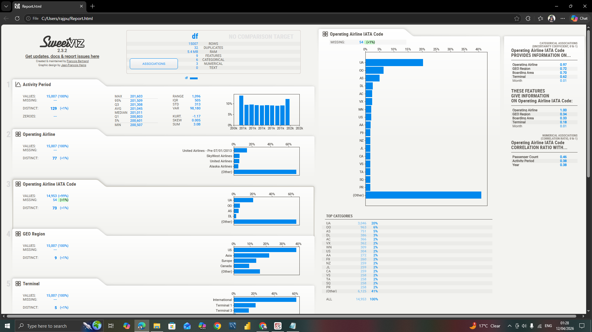

### 🔍 Insights

- UA (United Airlines) has the highest frequency.
- Strong relationship exists between airline code and operating airline.
- Airline operational dominance can be tracked using IATA codes.

---

## 6️⃣ Passenger Count Analysis

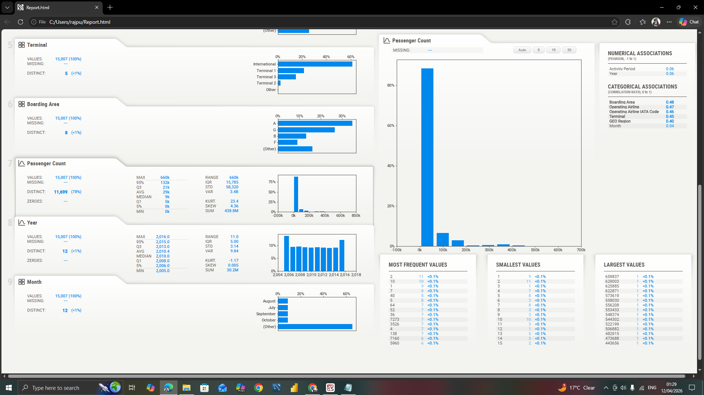

### 🔍 Insights

- Passenger count distribution is highly right-skewed.
- Most airlines handle lower passenger traffic.
- A few airlines dominate the overall passenger market.

---

## 7️⃣ Terminal Analysis

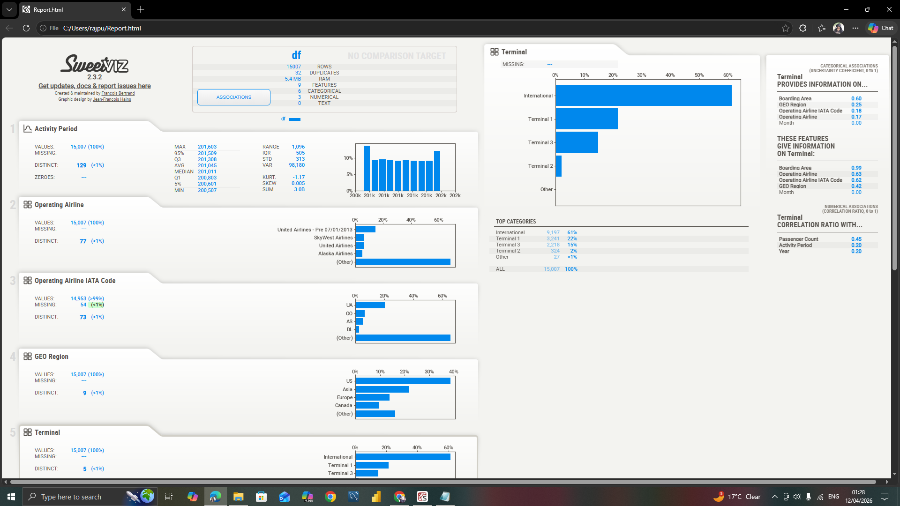

### 🔍 Insights

- International Terminal handles the highest traffic.
- Terminal 1 and Terminal 3 are secondary high-traffic terminals.
- Terminal distribution reflects operational airline density.

---

## 8️⃣ Year Analysis

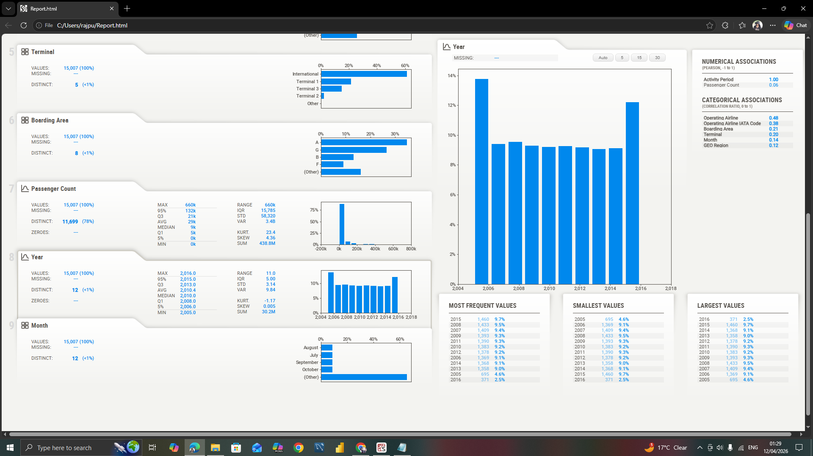

### 🔍 Insights

- Airline activity remained relatively stable across years.
- Slight growth observed in later years.
- Passenger operations increased steadily over time.

---

## 9️⃣ Month Analysis

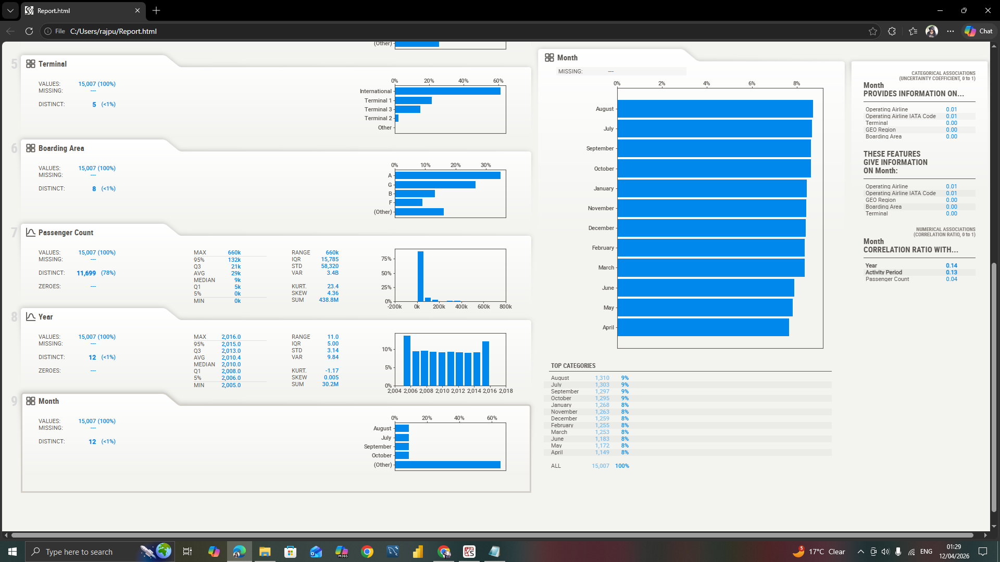

### 🔍 Insights

- August and July recorded the highest airline activity.
- Seasonal passenger trends are visible.
- Airline operations remain relatively balanced across months.

---

# 🤖 Clustering Models

## 🔹 K-Means Clustering

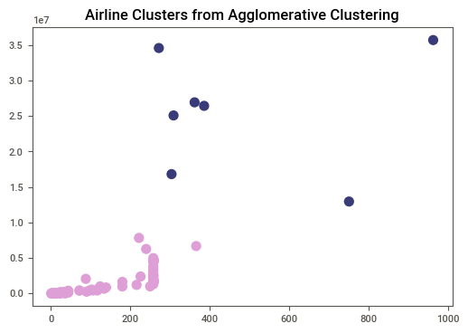

### 🔍 Insights

- K-Means successfully separates high and low traffic airlines.
- Airlines with similar operational behavior are grouped together.
- Clustering clearly distinguishes major airlines from smaller carriers.

---

## 🔹 Agglomerative Hierarchical Clustering

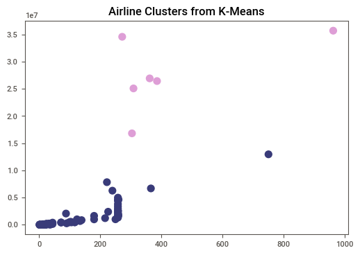

### 🔍 Insights

- Hierarchical clustering groups airlines based on distance similarity.
- Large airlines form independent clusters.
- Smaller airlines remain densely grouped together.

---

## 🔹 DBSCAN Clustering

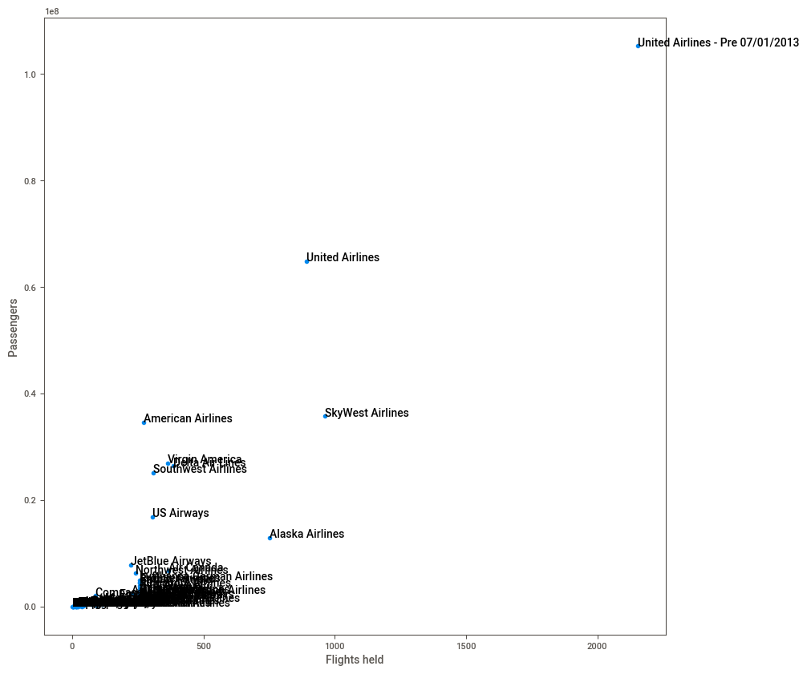

### 🔍 Insights

- DBSCAN identifies dense airline regions effectively.
- Noise and outliers are handled better compared to K-Means.
- Airlines with unusual passenger behavior are isolated automatically.

---

# 📏 Model Evaluation

Silhouette Score was used to evaluate clustering quality.

### Algorithms Evaluated

- K-Means
- Agglomerative Clustering
- DBSCAN

### 🔍 Insights

- Higher silhouette score indicates better cluster separation.
- DBSCAN performed effectively in detecting density-based patterns.
- K-Means performed well for balanced cluster segmentation.

---

# 🧠 Machine Learning Workflow

## Step 1: Data Collection

- Loaded airline passenger dataset.

## Step 2: Database Integration

- Connected dataset with MySQL using SQLAlchemy.

## Step 3: Data Cleaning

- Checked missing values
- Removed duplicates
- Selected important features

## Step 4: EDA

- Performed descriptive analysis
- Generated Sweetviz report
- Identified outliers

## Step 5: Outlier Removal

- Removed major airline outliers before clustering.

## Step 6: Clustering

Applied:
- K-Means
- Agglomerative Clustering
- DBSCAN

## Step 7: Model Evaluation

- Used silhouette score for evaluation.

## Step 8: Model Saving

- Saved DBSCAN model using Pickle.

---

# 🚀 Future Improvements

- Apply PCA for dimensionality reduction.
- Build interactive dashboards using Power BI.
- Deploy clustering app using Streamlit.
- Compare clustering using Gaussian Mixture Models.
- Add real-time airline traffic prediction.

---

# 📁 Repository Structure

```bash
DBSCAN-Project/
│
├── Images/
│   ├── airline_scatterplot_analysis.png
│   ├── dbscan_clustering_result.png
│   ├── hierarchical_clustering_result.png
│   ├── kmeans_clustering_result.png
│   ├── sweetviz_activity_period_analysis.png
│   ├── sweetviz_boarding_area_analysis.png
│   ├── sweetviz_geo_region_analysis.png
│   ├── sweetviz_iata_code_analysis.png
│   ├── sweetviz_month_analysis.png
│   ├── sweetviz_operating_airline_analysis.png
│   ├── sweetviz_passenger_count_analysis.png
│   ├── sweetviz_terminal_analysis.png
│   └── sweetviz_year_analysis.png
│
├── H_Clustering_kmeans_DBscan.py
├── Report.html
├── db.pkl
└── README.md
```

---

# 🎯 Conclusion

This project demonstrates the power of clustering algorithms in identifying hidden airline operational patterns.

The project successfully showcases:

- Data preprocessing
- Automated EDA
- Outlier detection
- Multiple clustering algorithms
- Cluster evaluation
- Business insight extraction

It also highlights the differences between:

- Distance-based clustering
- Hierarchical clustering
- Density-based clustering

---

# 👨‍💻 Author

**Lucky Singh**  
Aspiring Data Scientist | Machine Learning Enthusiast
